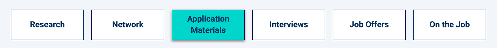

# Application

## Challenge: PyChain Ledger

### Background

You’re a fintech engineer who’s working at one of the five largest banks in the world. You were recently promoted to act as the lead developer on their decentralized finance team. Your task is to build a blockchain-based ledger system, complete with a user-friendly web interface. This ledger should allow partner banks to conduct financial transactions (that is, to transfer money between senders and receivers) and to verify the integrity of the data in the ledger.

### What You're Creating

You’ll make the following updates to the provided Python file for this Challenge, which already contains the basic `PyChain` ledger structure that you created throughout the module:

* Create a new data class named `Record`. This class will serve as the blueprint for the financial transaction records that the blocks of the ledger will store.

* Change the existing `Block` data class by replacing the generic `data` attribute with a `record` attribute that’s of type `Record`.

* Create additional user input areas in the Streamlit application. These input areas should collect the relevant information for each financial record that you’ll store in the `PyChain` ledger.

* Test your complete `PyChain` ledger.

You’ll then upload the Python file for this Challenge to your GitHub repository. Make sure to update the `README.md` file to include an explanation of the Steamlit application, a screenshot or video of your deployed Streamlit application, and any other information that’s needed to interact with your project.

### Files

Download the following files to help you get started:

[Module 18 Challenge files](Challenge/Starter_Code.zip)

### Instructions

Open the `pychain.py` file that your Challenge files include. You’ll use this file to complete the steps for this Challenge. Notice that the `PyChain` ledger that you built throughout this module already includes the functionality to create blocks, perform the proof of work consensus protocol, and validate blocks in the chain.

The steps for this Challenge are divided into the following sections:

1. Create a Record Data Class

2. Modify the Existing Block Data Class to Store Record Data

3. Add Relevant User Inputs to the Streamlit Interface

4. Test the PyChain Ledger by Storing Records

#### Step 1: Create a Record Data Class

Define a new Python data class named `Record`. Give this new class a formalized data structure that consists of the `sender`, `receiver`, and `amount` attributes. To do so, complete the following steps:

1. Define a new class named `Record`.

2. Add the `@dataclass` decorator immediately before the `Record` class definition.

3. Add an attribute named `sender` of type `str`.

4. Add an attribute named `receiver` of type `str`.

5. Add an attribute named `amount` of type `float`.

Note that you’ll use this new `Record` class as the data type of your `record` attribute in the next section.

#### Step 2: Modify the Existing Block Data Class to Store Record Data

Rename the `data` attribute in your `Block` class to `record`, and then set it to use an instance of the new `Record` class that you created in the previous section. To do so, complete the following steps:

1. In the `Block` class, rename the `data` attribute to `record`.

2. Set the data type of the `record` attribute to `Record`.

#### Step 3: Add Relevant User Inputs to the Streamlit Interface

Code additional input areas for the user interface of your Streamlit application. Create these input areas to capture the sender, receiver, and amount for each transaction that you’ll store in the `Block` record. To do so, complete the following steps:

1. Delete the `input_data` variable from the Streamlit interface.

2. Add an input area where you can get a value for `sender` from the user.

3. Add an input area where you can get a value for `receiver` from the user.

4. Add an input area where you can get a value for `amount` from the user.

5. As part of the Add Block button functionality, update `new_block` so that `Block` consists of an attribute named `record`, which is set equal to a `Record` that contains the `sender`, `receiver`, and `amount` values. The updated `Block`should also include the attributes for `creator_id` and `prev_hash`.

#### Step 4: Test the PyChain Ledger by Storing Records

Test your complete `PyChain` ledger and user interface by running your Streamlit application and storing some mined blocks in your `PyChain` ledger. Then test the blockchain validation process by using your `PyChain` ledger. To do so, complete the following steps:

1. In the terminal, navigate to the project folder where you've coded the Challenge.

2. In the terminal, run the Streamlit application by using `streamlit run pychain.py`.

3. Enter values for the sender, receiver, and amount, and then click the Add Block button. Do this several times to store several blocks in the ledger.

4. Verify the block contents and hashes in the Streamlit drop-down menu. Take a screenshot of the Streamlit application page, which should detail a blockchain that consists of multiple blocks. Include the screenshot in the `README.md` file for your Challenge repository.

5. Test the blockchain validation process by using the web interface. Take a screenshot of the Streamlit application page, which should indicate the validity of the blockchain. Include the screenshot in the `README.md` file for your Challenge repository.

### Requirements

#### Step 1: Create a Record Data Class (20 points)

To receive all points, you must:

* Successfully define a new class named `Record`. (10 points)

* Implement the required class attributes for the `Record` class. (10 points)

#### Step 2: Modify the Existing Block Data Class to Store Record Data (20 points)

To receive all points, you must:

* Rename the `data` attribute in the `Block` class to `record`. (10 points)

* Set the data type of the `record` attribute to `Record`. (10 points)

#### Step 3: Add Relevant User Inputs to the Streamlit Interface (20 points)

To receive all points, you must:

* Add the correct user inputs for getting the sender, receiver, and amount. (10 points)

* Correctly update the Add Block button functionality. (10 points)

#### Step 4: Test the PyChain Ledger by Storing Records (10 points)

To receive all points, you must:

* Test the functionality of your chain. In the `README.md` file for your GitHub repository, include a screenshot that contains a blockchain consisting of several blocks. (5 points)

* Confirm that your blockchain is valid. In the `README.md` file of your GitHub repository, include a screenshot of the Streamlit application page displaying “Blockchain is Valid.” (5 points)

#### Coding Conventions and Formatting (10 points)

To receive all points, your code must:

* Place imports at the top of the file, just after any module comments and docstrings, and before module globals and constants. (3 points)

* Name functions and variables with lowercase characters, with words separated by underscores. (2 points)

* Follow DRY (Don't Repeat Yourself) principles, creating maintainable and reusable code. (3 points)

* Use concise logic and creative engineering where possible. (2 points)

#### Deployment and Submission (10 points)

To receive all points, you must:

* Submit a link to a GitHub repository that’s cloned to your local machine and that contains your files. (4 points)

* Use the command line to add your files to the repository. (3 points)

* Include appropriate commit messages for your files. (3 points)

#### Comments (10 points)

To receive all points, your code must:

* Be well commented with concise, relevant notes that other developers can understand. (10 points)

### Submission

To submit your Challenge assignment, click Submit, and then provide the URL of your GitHub repository for grading.

> **Note** You are allowed to miss up to two Challenge assignments and still earn your certificate. If you complete all Challenge assignments, your lowest two grades will be dropped. If you wish to skip this assignment, click Next, and move on to the next Module.

Comments are disabled for graded submissions in BootCamp Spot. If you have questions about your feedback, please notify your instructional staff or your Student Success Manager. If you would like to resubmit your work for an improved grade, you can use the Resubmit Assignment button to upload new links.  You may resubmit up to three times for a total of four submissions.

## Career Connection

Congratulations on finishing your first blockchain module, and welcome to a rapidly growing field of fintech! Are you ready to learn about how you may encounter blockchain in the workplace?

Here’s the Career Connection agenda for today:

* Blockchain with Python in the Workplace

* Finding Your Career Fit: Designing a Stand-Out Online Portfolio

* Interview Prep

* Next Steps

### Blockchain with Python in the Workplace

Because you have gained a strong understanding of Python in this course, we decided to introduce you to blockchain technology via Python. While Python is used in the world of blockchain, you will find that several other languages are also popular. So, let’s discuss some languages used by blockchain developers, including Python.

#### Python
Python is excellent at handling numbers and has a large community. A lot of blockchains have tools that allow people to develop on them by using Python. One such tool is Brownie, a framework that enables users to develop Ethereum smart contracts by using Python.

#### C++

Bitcoin, the first ever implementation of blockchain, was written in C++. This language is suitable for blockchain because it has many of the same principles such as abstraction, encapsulation, data hiding, and polymorphism.

#### Solidity
You will learn Solidity later in this course! Solidity was specifically designed for blockchain development. It is most commonly used among Ethereum developers.

#### JavaScript

JavaScript is the [most popular programming language](https://insights.stackoverflow.com/survey/2021#:~:text=most%20popular%20technology.-,Programming%2C%20scripting%2C%20and%20markup%20languages,-JavaScript%20completes%20its) in the world. The appeal of using JavaScript for blockchain development is that it eliminates integration concerns, as most systems already run JavaScript.

Other languages used for blockchain technology include Go, Simplicity, Rholang, and Vyper. Depending on your role and industry, you may find yourself diving into a new language for blockchain development. Your Python skills and Solidity skills (to come in a later module) are a great foundation to ensure your success.

### Finding Your Career Fit: Designing a Stand-Out Online Portfolio

Some companies may request an online portfolio as part of their application process. We celebrate this as an opportunity for you to stand out from the crowd and show off your skills.

You likely already understand that your portfolio should be organized and well-designed, and showcase your strengths. We’ve laid out these basic requirements in this [Portfolio Guide](https://careernetwork.2u.com/articles/portfolio-and-github-web-development/#:~:text=Building%20a%20Competitive%20Portfolio). In this Career Connection, we’ll discuss an element that will make your portfolio stand out.

> **Note** The guidance in this section is targeted at students who are starting their career and students switching industries. If this doesn’t apply to you, then you may already be implementing today’s advice.

The number-one portfolio tip that hiring managers tell us is for applicants to include personal and enterprise projects. While your course projects are valuable learning opportunities and certainly demonstrate your advanced skills, employers also need to know what differentiates you from a pool of applicants. We suggest including your course projects in your portfolio and adding one or two non-course projects that highlight your interests and skills. They should also be relevant to the types of jobs that you are applying to. Use the technology that you want to use on the job, show off your transferable skills, and solve problems that you find interesting.

Here are a few ideas to help you get started:

* Help out a friend’s small business.
* Build something related to one of your hobbies.
* Build something for your current employer.
* Create a project related to a specific job description. (For example, if you want to work on robo-advisors, build a unique robo-advisor.)
* Expand upon one of your course projects.

We hope that this tip helps you take your portfolio from great to exceptional.

> **Interview Prep**
>
> Read each question, enter your answer in a notebook file or text editor, and then compare your response to the provided one.
>
> **Note:** The lessons didn’t explicitly cover all the questions. However, the skills and concepts that you learned (plus your research skills) should have prepared you to answer them.
>
> 1. What is meant by “blocks” in blockchain technology?
>
>    * Answer: Each record is stored as a block. The blocks link together to form a ledger called a blockchain.
>
> 2. What is a genesis block?
>
>    * Answer: The genesis block is the first block in a chain.
>
> 3. What is the difference between a hard fork and a soft fork in a blockchain?
>
>    * Answer: A fork happens when a significant change is made to a software’s protocol. It results in two versions, the old and the new. In a hard fork, both versions of the protocol continue to exist. In a soft fork, only the new blockchain remains valid, and all users must adopt the update.

### Next Steps
* Consider adding your blockchain skills to your application materials.

* Ideate on personal projects that you could add to your GitHub profile or online portfolio in order to stand out from other applicants.
